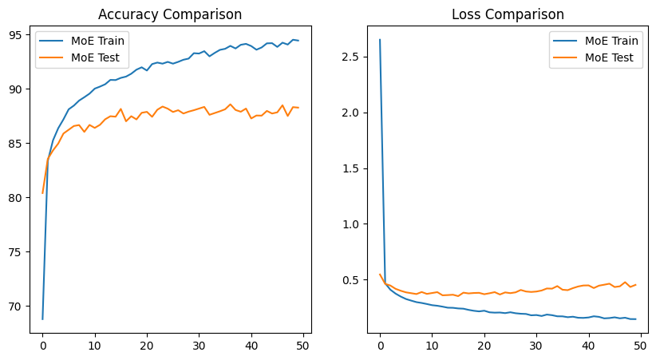
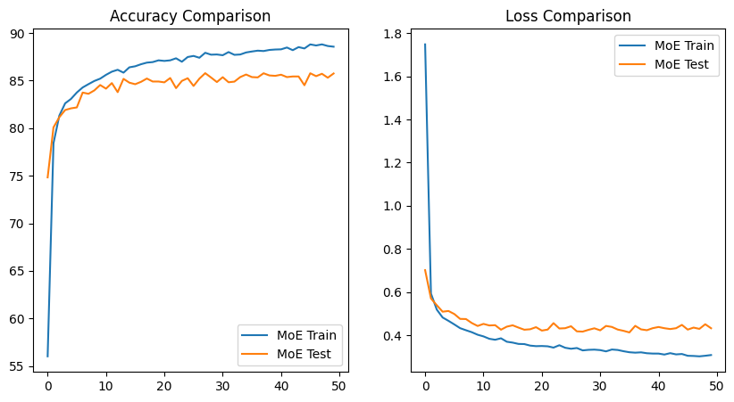
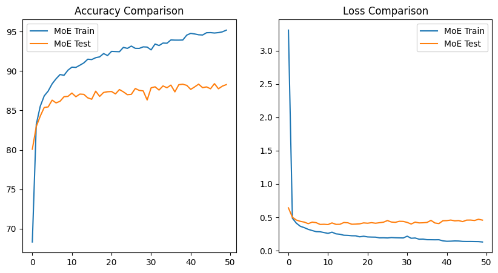

# Learning_project_Mixture_of_Experts_MINST
>This project explores the concept of Mixture of Experts (MoE) by applying it to the MNIST digit classification task.  
>We implement and train three different MoE variants: Dense MoE, Sparse MoE, and Soft MoE, comparing their performance and training characteristics.  

## 📂 Project Structure
```
├── MoE_Dense.ipynb          # Jupyter Notebook for Dense Mixture of Experts
├── MoE_Sparse.ipynb         # Jupyter Notebook for Sparse Mixture of Experts
├── MoE_Soft.ipynb           # Jupyter Notebook for Soft Mixture of Experts
├── data/                    # MNIST dataset (downloaded automatically by PyTorch)
└── README.md                # Project documentation
```
## Introduction: Mixture of Experts (MoE)
The Mixture of Experts framework is a neural network architecture that divides computation among multiple “experts” (sub-networks).  
A gating network learns to assign input samples to these experts, either fully or partially, allowing the model to specialize and improve efficiency.  
We study three MoE variants:  
1. Dense Mixture of Experts  
    - Every expert is active for each input.  
    - The gating network produces weights for all experts, and their outputs are combined.  
    - Pros: Simple, stable, easy to train.  
    - Cons: Computation-heavy (all experts run every time).  
2. Sparse Mixture of Experts
    - Only a small subset of experts (e.g., top-k) are activated per input.  
    - Reduces computation while still allowing specialization.  
    - Pros: Efficient, scalable to large models.  
    - Cons: Harder to balance training (load balancing needed).  
3. Soft Mixture of Experts
    - A relaxation of Sparse MoE.  
    - Instead of hard selection, each expert is assigned a soft probability weight, often with techniques like softmax temperature scaling.  
    - Pros: Differentiable, smoother gradient flow.  
    - Cons: More computational cost than Sparse, but often more stable.  

## Training Setup
Dataset: MNIST (handwritten digit classification, 28×28 grayscale images).  
Framework: PyTorch  
Loss Function: CrossEntropyLoss  
Optimizer: Adam  
Training Method: Each MoE variant is trained in its own Jupyter Notebook.  

## Notebooks
Dense MoE -> [MoE_Dense.ipynb](MoE_Dense.ipynb)  
Sparse MoE -> [MoE_Sparse.ipynb](MoE_sparse.ipynb)  
Soft MoE -> [MoE_Soft.ipynb](MoE_Soft.ipynb)  

## Results
| Dense | Sparse | Soft |
|---|---|---|
|  |  |  |

## Acknowledgements
MNIST Dataset  
Original Mixture of Experts idea: Jacobs et al., 1991  
Recent scaling: Switch Transformer (Fedus et al., 2021)  